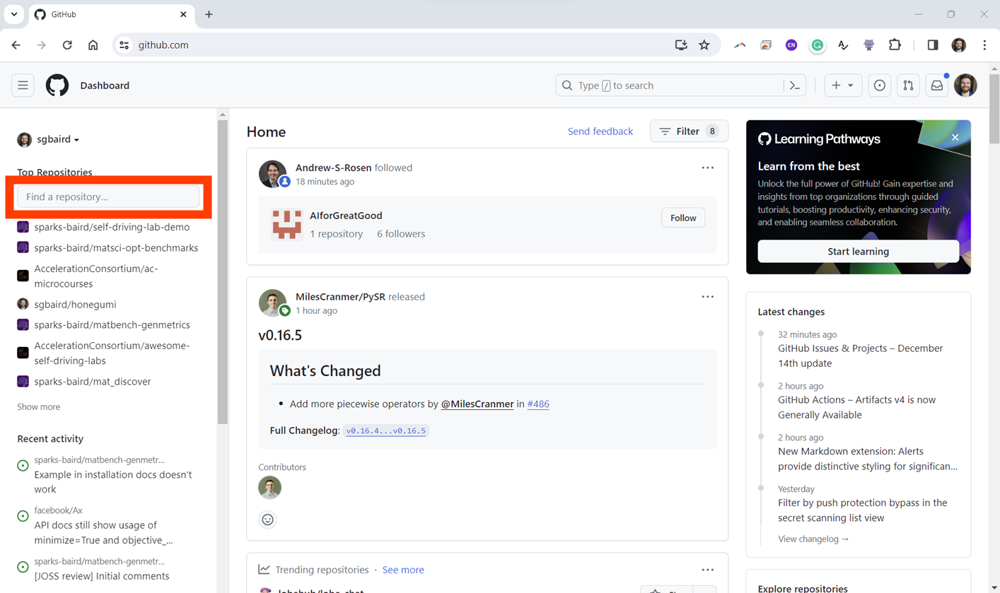
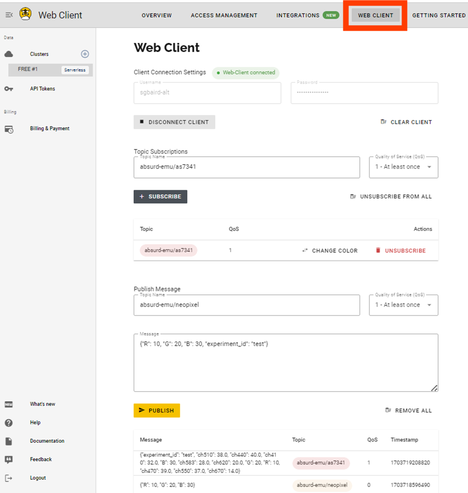

# Hardware/Software Communication
Send commands to and receive sensor data from a microcontroller using the MQTT protocol.

## The assignment
The tests are failing right now because your HiveMQ credentials have not been added as GitHub repository secrets and [microcontroller_client.py](./microcontroller_client.py) and [orchestrator_client.py](./orchestrator_client.py) are not fully implemented. Wherever you see `...` within the script requires you to write your own code. See below for instructions about adding your HiveMQ credentials as GitHub repository secrets and completing the scripts.

### HiveMQ Credentials as GitHub Repository Secrets

> NOTE: Recently, HiveMQ Cloud changed such that `hivemq-com-chain.der` (a Certificate Authority (CA) file) is not transferrable across different broker instances. The [latest `hivemq-com-chain.der` file](https://raw.githubusercontent.com/sparks-baird/self-driving-lab-demo/main/src/public_mqtt_sdl_demo/hivemq-com-chain.der) from [`self-driving-lab-demo`](https://github.com/sparks-baird/self-driving-lab-demo) will be hard-coded to the `self-driving-lab-demo` public test credentials (i.e., what is used in Module 1 - Running the Demo). However, this assignment requires you to create your own HiveMQ Cloud broker instance, so you will need to [generate a `hivemq-com-chain.der` file specific to your instance](https://colab.research.google.com/github/sparks-baird/self-driving-lab-demo/blob/main/notebooks/7.2.1-hivemq-openssl-certificate.ipynb) and upload it to your microcontroller.

A complete walkthrough video for setting up HiveMQ and adding the GitHub repo secrets is provided at the end of this section. Please read through all the instructions in this section before starting.

First, create a HiveMQ Cloud account at https://console.hivemq.cloud/. By default, a free-tier cluster should have been created for you. If not, create a new cluster. Copy the cluster URL to somewhere secure (e.g., notepad). Then, click "manage cluster" followed by "access management". Create a new user with "publish and subscribe" permissions and be sure to store the username and password somewhere secure. See also step 13b of the light-mixing demo *Build Instructions* manuscript [🔗 DOI: 10.1016/j.xpro.2023.102329](https://doi.org/10.1016/j.xpro.2023.102329).

Next, you will add the HiveMQ credentials as GitHub repository secrets so that the credentials are available to Codespaces and GitHub Actions. The secrets to be added are as follows:

| Variable Name       | Description |
|---------------------|-------------|
| `COURSE_ID`         | Your student identifier for the course |
| `HIVEMQ_HOST`       | The HiveMQ cluster host URL |
| `HIVEMQ_USERNAME`   | The HiveMQ username |
| `HIVEMQ_PASSWORD`   | The HiveMQ password |

While you could put this information directly in your Python files, this is a bad practice and can easily lead to leaking your credentials, so let's set good habits! You should [never commit sensitive data directly to a repository](https://security.stackexchange.com/questions/191590/why-is-storing-passwords-in-version-control-a-bad-idea) (even if it's a private repository), if at all possible. If you do, there are [ways to remove it from the repository's history](https://docs.github.com/en/authentication/keeping-your-account-and-data-secure/removing-sensitive-data-from-a-repository) (by the way, deleting the whole repo is almost never the answer), but it's best to avoid leaking sensitive data in the first place. Removing it from history doesn't stop someone with access from saving or storing it prior to its removal. Taking from the article above:

> Once you have pushed a commit to GitHub, you should consider any sensitive data in the commit compromised. If you have committed a password, you should change it. If you have committed a key, generate a new one. Removing the compromised data doesn't resolve its initial exposure, especially in existing clones or forks of your repository.

Thankfully, GitHub provides a way to store secrets that can be used by GitHub Actions and Codespaces. Navigate to your GitHub assignment repository. The link will be of the form `https://github.com/ACC-HelloWorld/4-hardware-software-communication-GITHUB_USERNAME`, where `GITHUB_USERNAME` is replaced with your own (e.g., `sgbaird`). If you have trouble finding it, you can also use the "find a repository" search bar (boxed in red in the image below) on your [GitHub homepage](https://github.com) after signing in.



Follow along with the video below to create your HiveMQ cluster and add your Codespaces and GitHub Actions secrets. Add each secret twice (once for Codespaces so you can run the tests manually and once for GitHub Actions so GitHub Classroom can do its autograding).

[▶️ HiveMQ and GitHub Secrets Walkthrough Video](hivemq-walkthrough.mp4)

Additional instructions for adding GitHub repository secrets are available in [Using secrets in GitHub Actions](https://docs.github.com/en/actions/security-guides/using-secrets-in-github-actions), and these can also be added [at a user-level](https://docs.github.com/en/codespaces/managing-your-codespaces/managing-secrets-for-your-codespaces).


### Microcontroller to Orchestrator

> NOTE: This section requires you to be actively running your completed code from this section on your microcontroller with it connected to a 2.4 GHz WPA-2 wireless network per the ["Before you Begin"](https://www.sciencedirect.com/science/article/pii/S2666166723002964?via%3Dihub#sec1) instructions, which you should have completed in a prior module. If you do not have the required wireless network, you can use a mobile hotspot in extended compatibility mode or a SIM-enabled router (see [recommendations](https://github.com/sparks-baird/self-driving-lab-demo/discussions/83)).

You will update [`microcontroller_client.py`](./microcontroller_client.py) based on [the tutorial example](https://ac-microcourses.readthedocs.io/en/latest/courses/hello-world/1.4-hardware-software-communication.html) so that it *receives commands* for controlling an RGB LED and *sends sensor data* from a (dummy) AS7341 light sensor along with the original command. A number of dummy modules are installed by default to allow you to run dummy tests without the microcontroller. This makes it easy to test on Codespaces while you're developing the script. However, you are expected to copy this code to your microcontroller and have it actively running during the testing for the tests to pass.

Use the file named [`my_secrets.py`](my_secrets.py) (autogenerated by Codespaces) instead of `secrets.py` to store your secrets to avoid clashing with Python's built-in `secrets` module when running on Codespaces and GitHub Actions. The file is created automatically when you create your codespace, but it is ignored by git (see [`.gitignore`](.gitignore)). You should not commit or push this file to the GitHub repo. Rather, it's something to be uploaded to the microcontroller.

Within the script, the `run_color_experiment` dummy function takes red, green, and blue values as inputs and returns a dictionary mapping from the channel names to the dummy intensity values. See the function documentation for more information and an example.

Since you will be passing plain text (i.e., python `string`-s) between the microcontroller and the orchestrator, you will need to convert Python dictionaries back and forth between text representations (in opposite order to the orchestrator code). You can use the `json` module to do this. Here is an example of how to use this module.

```python
import json

# Convert a Python dictionary to a JSON string
dict_obj = {"key1": "value1", "key2": "value2", "key3": "value3"}
json_str = json.dumps(dict_obj)
print(json_str)
# Output: '{"key1": "value1", "key2": "value2", "key3": "value3"}'

# Convert a JSON string to a Python dictionary
json_str = '{"key1": "value1", "key2": "value2", "key3": "value3"}'
dict_obj = json.loads(json_str)
print(dict_obj)
# Output: {'key1': 'value1', 'key2': 'value2', 'key3': 'value3'}
```

You are required to return the original command (i.e., `R`, `G`, `B`, and `experiment_id`) along with the sensor data. The dictionary should be of the form:

```python
{
    "command": {"R": ..., "G": ..., "B": ...},
    "sensor_data": {"ch410": ..., "ch440": ..., ..., "ch670": ...},
    "experiment_id": "...",
}
```

See the example below for how to combine the original payload dictionary with the new sensor data in MicroPython:

```python
payload_dict = {"command": {"R": 255, "G": 0, "B": 0}, "experiment_id": "abc123"}
sensor_data = {
    "ch410": 25,
    "ch440": 51,
    "ch470": 76,
    "ch510": 102,
    "ch550": 127,
    "ch583": 153,
    "ch620": 229,
    "ch670": 255,
}
results = payload_dict.copy()
results.update({"sensor_data": sensor_data})
# {'command': {'R': 255, 'G': 0, 'B': 0}, 'experiment_id': 'abc123', 'sensor_data': {'ch410': 25, 'ch440': 51, 'ch470': 76, 'ch510': 102, 'ch550': 127, 'ch583': 153, 'ch620': 229, 'ch670': 255}}
```
Note that Python's ["unpack" operator](https://chat.openai.com/share/0dd75ad3-f428-4439-a77b-cb3ccd9e4786) (`**`) is not supported in MicroPython on the Pico W, hence the copy-and-update approach above.

#### Troubleshooting

If you're having trouble getting the tests to pass, please refer to the following checklist:

- [ ] You have added your HiveMQ credentials and course ID as GitHub Actions *and* Codespaces secrets
- [ ] `mqtt_as.py` is uploaded to your microcontroller (either in the top-level directory or within the `lib` directory)
- [ ] There is a `my_secrets.py` file *on your microcontroller*
- [ ] You have updated the `my_secrets.py` file *on your microcontroller* with your HiveMQ credentials *and* course ID
- [ ] The code on your microcontroller is actively running

Additionally, you can use the HiveMQ Web Client associated with your account to help with troubleshooting. See the picture below:



### Orchestrator to Microcontroller

You will update [`orchestrator_client.py`](orchestrator_client.py) based on [the tutorial example](https://ac-microcourses.readthedocs.io/en/latest/courses/hello-world/1.4.1-onboard-led-temp.html) so that it *sends commands* to control a RGB LED and *receives sensor data* from the AS7341 light sensor. Here, a dummy function on the microcontroller is used to simulate the sensor data, but you will still need to implement the MQTT communication.

For this, you will need to load the GitHub secrets that you created earlier, which are stored as environment variables. Here is an example of how to use these variables in Python. You can use this to access your HiveMQ credentials in your Python scripts.

```python
import os

broker = os.environ["HIVEMQ_HOST"]
course_id = os.environ["COURSE_ID"]
username = os.environ["HIVEMQ_USERNAME"]
password = os.environ["HIVEMQ_PASSWORD"]
```

If the environment variables are not set properly, then the script will
raise a `KeyError` exception.

Since you will be passing plain text (i.e., python `string`-s) between the microcontroller and the orchestrator, you will need to convert Python dictionaries back and forth between text representations. You can use the `json` module to do this. Here is an example of how to use this module. Note the outer single quotes and inner double quotes in the string representation of the dictionary.

```python
import json

# Convert a Python list of dictionaries to a JSON string
data = [{"key1": "value1", "key2": "value2"}, {"key3": "value3", "key4": "value4"}]
json_str = json.dumps(data)
print(json_str)
# Output: '[{"key1": "value1", "key2": "value2"}, {"key3": "value3", "key4": "value4"}]'

# Convert a JSON string to a Python list of dictionaries
json_str = '[{"key1": "value1", "key2": "value2"}, {"key3": "value3", "key4": "value4"}]'
data = json.loads(json_str)
print(data)
# Output: [{'key1': 'value1', 'key2': 'value2'}, {'key3': 'value3', 'key4': 'value4'}]
```

At the end of the file, the results is written to a JSON file, which is used by the autograder to check your results. This uses the `json` module to write the data to a file. Here is a simple example of how this works. Pay attention to the usage of `dump` to write to a file in the script below vs. the use of `dumps` to convert directly from a string as used above.

```python
import json

data = [{"key1": "value1", "key2": "value2"}, {"key3": "value3", "key4": "value4"}]
with open("data.json", "w") as f:
    json.dump(data, f)
```

## Run command
`pytest`

You can also use the "Testing" sidebar extension to easily run individual tests.

To run tests in an individual file on the command line, you can specify the filename after. For example, to run the tests in `test_orchestrator_client.py`, you can use the following command.

```
pytest test_orchestrator_client.py
```

<!-- Likewise, for `test_microcontroller_client.py`, you can use the following command.

```
pytest test_microcontroller_client.py
```

And for `test_github_secrets.py`:

```
pytest test_github_secrets.py
``` -->

## Setup command

See `postCreateCommand` from [`devcontainer.json`](.devcontainer/devcontainer.json).
